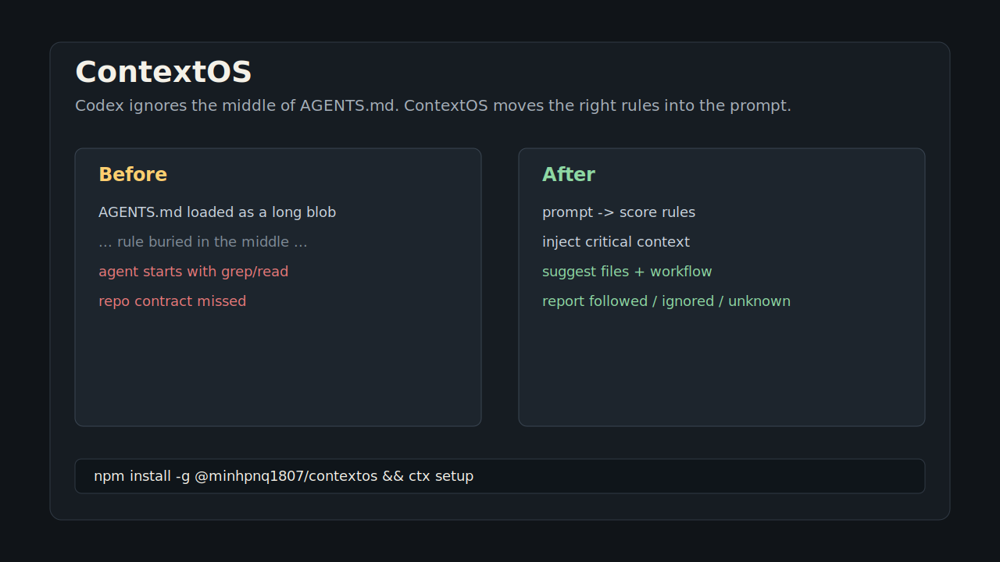

# ContextOS

Codex ignores the middle of your `AGENTS.md`. ContextOS fixes that.

It ranks your project rules against the current prompt, injects the right ones at the moment the agent starts work, suggests relevant files/skills/workflows, and reports what the agent actually followed after the task.

```text
WITHOUT ContextOS
  AGENTS.md is a long static blob
  important rules drift into the middle
  agent starts by grepping files and misses the repo contract

WITH ContextOS
  prompt -> score relevant AGENTS.md rules
         -> inject critical rules at top and bottom
         -> suggest files, skills, workflows
         -> report followed / ignored / unknown
```

Published package: [`@minhpnq1807/contextos`](https://www.npmjs.com/package/@minhpnq1807/contextos)

## Demo



Example hook context injected before the agent works:

```text
## Critical ContextOS rules
- IMPORTANT: This project has a knowledge graph. ALWAYS use code-review-graph MCP tools before Grep/Glob/Read.
- Use `query_graph` pattern="tests_for" to check coverage.

## Suggested files to check
- services/content-service/test/unit/creator-only.policy.unit-spec.ts
- services/content-service/test/integration/resource-upload.integration-spec.ts

## Suggested workflow for this task
- Primary Workflow: use for feature implementation, testing, review, and debugging
  chain: planner -> tester -> code-reviewer
```

After the task:

```text
ContextOS report
Efficiency: 100%
Injected rules: 8
Rule outcomes: 8 followed, 0 ignored, 0 unknown
Runtime telemetry: code-review-graph, code-review-graph.query_graph_tool
```

## Install In One Line

```bash
npm install -g @minhpnq1807/contextos && ctx setup
```

No postinstall surprise: `npm install` only installs the CLI. Setup runs only when you call `ctx setup`.

Scriptable setup:

```bash
ctx setup --yes
ctx setup --yes --agents codex,claude,agy
```

No global install:

```bash
npm exec --yes --package=@minhpnq1807/contextos@latest -- ctx setup
npm exec --yes --package=@minhpnq1807/contextos@latest -- ctx-codex install
```

Codex-only:

```bash
ctx install
```

Claude Code and Antigravity:

```bash
ctx install claude
ctx install agy
```

Restart the agent after setup. Then use the agent normally.

## Why

Developers put real operating instructions in `AGENTS.md`: use this graph tool before reading files, run these tests, follow this architecture boundary, avoid this migration path.

The problem is not that agents cannot read `AGENTS.md`. The problem is that large context windows bury the important rule in the middle, where attention is weak. ContextOS turns a static rules file into task-aware runtime context.

## What ContextOS Does

| Layer | What happens |
| --- | --- |
| Hooks | Codex, Claude Code, and Antigravity hooks run before/after each task. |
| Scoring | Local MiniLM embeddings plus heuristics rank AGENTS.md rules by the prompt. |
| Injection | Critical rules are placed with primacy + recency, not buried in the middle. |
| Discovery | Relevant files, skills, and workflows are suggested before work starts. |
| Sync | Rules/MCP via Ruler, skills via skillshare, workflows via ContextOS. |
| Evidence | Stop hooks report `followed`, `ignored`, `unknown`, and runtime telemetry. |

## Quick Commands

| Command | Use it for |
| --- | --- |
| `ctx setup` | Recommended first-run install flow. |
| `ctx debug -- "Recheck authen flow"` | Preview what ContextOS would inject. |
| `ctx report` | Show the last task's compliance summary. |
| `ctx evidence` | Show why each rule was marked followed/ignored/unknown. |
| `ctx stats` | Show workspace-level usage and effectiveness metrics. |
| `ctx benchmark -- "task"` | Compare raw AGENTS.md ordering vs ContextOS scheduling. |
| `ctx sync --rules` | Sync AGENTS/Ruler/MCP config across agents. |
| `ctx sync --skills` | Sync skills across agents through skillshare. |
| `ctx sync --workflows` | Sync workflow markdown across Claude/Codex/Antigravity. |

## 60-Second Demo Script

1. Start in a repo with an `AGENTS.md` that contains a rule like:

```text
Always use code-review-graph MCP tools before reading files.
```

2. Install:

```bash
npm install -g @minhpnq1807/contextos
ctx setup --yes --agents codex
```

3. Restart Codex and submit:

```text
Recheck authen flow
```

4. Show the injected `hook context`.

5. Let the task finish, then run:

```bash
ctx report
ctx evidence
```

The demo should show one idea: ContextOS puts the right rule in front of the agent before work starts, then proves whether the rule was followed.

## Detailed Install

From the package:

```bash
npm install -g @minhpnq1807/contextos
ctx install
```

Without a global install:

```bash
npx @minhpnq1807/contextos@latest install
```

From this repository during local development:

```bash
node bin/ctx.js install
```

Agent-specific installers:

```bash
ctx install codex
ctx install claude
ctx install agy
ctx install --agent codex
ctx install --agent claude
ctx install --agent agy
```

`ctx install` defaults to `ctx install codex`.

### Codex

`ctx install codex` does these things:

1. Copies this package into `$CODEX_HOME/marketplaces/contextos`.
2. Registers and installs `ctx@contextos` through Codex plugin marketplace commands.
3. Downloads and caches the required local MiniLM embedding model under `~/.ctx/contextos/models`.
4. Warms `~/.ctx/contextos/embeddings.db` for AGENTS rules and project file paths.
5. Registers the `ctx-mcp` MCP server and merges ContextOS global hooks into `$CODEX_HOME/hooks.json`.
6. Wraps configured local MCP servers, except ContextOS' own `ctx-mcp`, with a transparent telemetry proxy so `tools/call` events can be measured. The original MCP command is preserved after the proxy separator and executed unchanged.

Restart Codex after installing.

### Claude Code

`ctx install claude` copies this package into `~/.ctx/contextos/agents/claude/contextos`, merges ContextOS hooks into `~/.claude/settings.json`, and registers `ctx-mcp` as a user-scoped Claude Code MCP server in `~/.claude.json`.

Claude Code receives prompt context through `UserPromptSubmit` using `hookSpecificOutput.additionalContext`, then ContextOS writes the same local workspace report files used by `ctx report`, `ctx evidence`, and `ctx stats`.

Restart Claude Code after installing.

### Antigravity

`ctx install agy` copies this package into `~/.ctx/contextos/agents/agy/contextos`, writes a `contextos` hook group into `~/.gemini/config/hooks.json`, and registers `ctx-mcp` in Antigravity MCP config locations:

```text
~/.gemini/antigravity/mcp_config.json
~/.gemini/antigravity-cli/mcp_config.json
~/.gemini/config/mcp_config.json
```

The third path supports older Antigravity editor builds where `@mcp` reads the legacy Gemini config directory.

Antigravity does not use `UserPromptSubmit`; ContextOS injects context through `PreInvocation` as an `ephemeralMessage`. The `Stop` adapter stores the report locally, so use `ctx report` or `ctx evidence` after the task to inspect outcomes.

Restart Antigravity or `agy` after installing.

The embedding model is mandatory. `ctx install` checks `~/.ctx/contextos/models` first and downloads the MiniLM model only when the required local files are missing. It intentionally fails if the model cannot be prepared, because otherwise the first prompt hook would have to cold-load or download the model.

During install, ContextOS prints a 0-100 progress indicator. The longest stage is usually embedding warmup; if the model is already cached, install skips the download and only refreshes vectors.

Verify the published package in any project:

```bash
npm exec --yes --package=@minhpnq1807/contextos@latest -- ctx --version
npm exec --yes --package=@minhpnq1807/contextos@latest -- ctx debug -- "Recheck authen flow"
```

## Skill Sync

Use skillshare when you want Codex, Claude Code, and Antigravity to share one skills catalog:

```bash
ctx sync --skills
```

ContextOS checks for `skillshare`, initializes it when needed, backs up existing skills before collection, runs `skillshare collect --all` unless `--no-collect` is provided, then runs `skillshare sync`. After sync, ContextOS rebuilds skill embeddings so prompt-time skill discovery can rank the shared source immediately.

The shared source is:

```text
~/.config/skillshare/skills/
```

Useful variants:

```bash
ctx sync --skills --dry-run
ctx sync --skills --no-collect
ctx sync --skills --agents codex,claude
ctx sync --skills --agents codex,claude,agy
```

After this, `ctx debug -- "task"` and prompt hooks can suggest skills from `~/.config/skillshare/skills/` plus agent-specific skill folders.

## Workflow Discovery

ContextOS can also sync Claude/Codex/Antigravity workflow markdown files and suggest the right workflow for the current task:

```bash
ctx sync --workflows
ctx sync --workflows --agents codex,claude,agy
ctx sync --workflows --dry-run
```

It scans project workflows first, then global workflows:

```text
.claude/workflows/
.codex/workflows/
.gemini/workflows/
.gemini/antigravity/workflows/
.gemini/antigravity-cli/workflows/
~/.claude/workflows/
~/.codex/workflows/
~/.gemini/workflows/
~/.gemini/antigravity/workflows/
~/.gemini/antigravity-cli/workflows/
```

Workflow files do not need YAML frontmatter. ContextOS reads the top `#` heading, section headings, and referenced agent names such as `planner`, `tester`, `code-reviewer`, and `docs-manager`, then warms semantic embeddings. Prompt hooks inject a `Suggested workflow for this task` section only when a workflow is relevant enough.

`ctx sync --workflows` reads every known project/global workflow root, keeps the first workflow for each filename/name according to root priority, then copies that unique set to the selected global agent roots. This prevents duplicate `primary-workflow` suggestions when the same workflow exists in Claude, Codex, and Antigravity directories.

## Modes

Injection mode is the default:

```bash
ctx install
```

In injection mode, ContextOS analyzes each prompt, stores runtime data, and returns task-relevant `additionalContext` to Codex. Codex may display that injected context in the UI.

Quiet mode:

```bash
ctx install --quiet
```

Quiet mode analyzes and measures prompts but returns an empty `additionalContext`, so Codex does not show a `hook context` block.

Explicit injection mode is also accepted:

```bash
ctx install --inject
```

Development copy mode:

```bash
ctx install --copy
```

Copies only the plugin payload into `$CODEX_HOME/plugins/ctx`. This is mostly for local experiments.

## Ruler Sync

Use Ruler when the project wants one rule/MCP source of truth for multiple agents:

```bash
ctx sync --rules
```

Default agents are `codex`, `claude`, and `agy` (Antigravity). Ruler's official identifier is still `antigravity`, so ContextOS accepts both `agy` and `antigravity` and normalizes them before calling Ruler. You can target a subset:

```bash
ctx sync --rules --agents codex
ctx sync --rules --agents codex,claude
ctx sync --rules --agents codex,claude,agy
ctx sync --rules --agents codex,claude,antigravity
```

What it does:

1. Checks that `ruler` is installed. If it is missing, ContextOS asks before running `npm install -g @intellectronica/ruler`; use `--yes` for non-interactive installs.
2. Runs `ruler init` when `.ruler/ruler.toml` is missing.
3. Adds `ctx-mcp` to `.ruler/ruler.toml` under `[mcp_servers.ctx-mcp]`.
4. Imports existing MCP servers from Codex `~/.codex/config.toml` and project `.mcp.json`, such as `code-review-graph`, `agentmemory`, and `mcp-rtk`, into `.ruler/ruler.toml`.
5. Adds enabled Ruler agent entries for Codex, Claude Code, and Antigravity using merge strategy.
6. Runs `ruler apply --agents ...`.
7. Mirrors the Ruler MCP server list into Antigravity app/CLI MCP configs because current Ruler versions do not emit every Antigravity MCP file consistently.
8. Verifies that generated agent config contains `ctx-mcp`.

Useful flags:

```bash
ctx sync --rules --dry-run
ctx sync --rules --force
ctx sync --rules --yes
ctx sync --rules --no-import-codex-mcp
```

`ctx sync --rules` is project-scoped. It writes `.ruler/ruler.toml` in the current project and lets Ruler generate agent files from that project source of truth. ContextOS runtime history still follows the project-path isolation model described below.

## Upstream Passthrough

ContextOS exposes thin passthrough commands for Ruler and skillshare admin/debug workflows:

```bash
ctx ruler -- apply --agents codex,claude,antigravity
ctx ruler -- init
ctx skillshare -- status
ctx skillshare -- target list
ctx skillshare -- doctor
```

Everything after `--` is forwarded unchanged to the upstream CLI. ContextOS does not reinterpret those args, and it preserves the upstream output and exit status. Use `ctx sync --rules` and `ctx sync --skills` for ContextOS-managed workflows; use passthrough when you need a native Ruler or skillshare command.

## Troubleshooting

### `ctx-mcp bridge socket not found`

Restart Codex after `ctx install`. The bridge socket is owned by the long-running `ctx-mcp` MCP server, so it exists only after Codex starts the server.

### `ContextOS model cache missing`

Run:

```bash
ctx embeddings warm -- "Recheck authen flow"
```

Then restart Codex.

### No report found

Run at least one Codex task with ContextOS enabled and let the task finish so the `Stop` hook can write `last-report.json`.

### `Average efficiency: unknown`

ContextOS only reports efficiency when it has concrete evidence. Diff-based rules are measured from git diff/status. Runtime-only rules, such as tool usage order, are measured from local hook telemetry when Codex exposes tool or command metadata. If neither source proves the outcome, the rule remains `unknown`.

### `npm warn deprecated prebuild-install@7.1.3`

This warning comes from a transitive dependency in the local embedding/WASM stack. It does not block installation or runtime commands. ContextOS still runs normally if npm exits with code `0`.

## Commands

| Command | Meaning | Use when | Output / side effect |
| --- | --- | --- | --- |
| `ctx install` | Installs ContextOS into Codex with prompt context injection enabled. | Normal Codex setup after installing the npm package. | Same as `ctx install codex`. |
| `ctx install codex` | Installs ContextOS into Codex. | You use the `codex` CLI. | Copies the plugin into `$CODEX_HOME/marketplaces/contextos`, registers `ctx@contextos`, registers `ctx-mcp`, installs global hooks, downloads the embedding model, and warms caches. |
| `ctx install claude` | Installs ContextOS into Claude Code. | You use the `claude` CLI. | Copies a stable package root to `~/.ctx/contextos/agents/claude/contextos`, merges hooks into `~/.claude/settings.json`, and registers `ctx-mcp` in `~/.claude.json`. |
| `ctx install agy` | Installs ContextOS into Antigravity. | You use the `agy` CLI or Antigravity app/editor. | Copies a stable package root to `~/.ctx/contextos/agents/agy/contextos`, writes hooks to `~/.gemini/config/hooks.json`, and registers `ctx-mcp` in Antigravity app, CLI, and legacy editor MCP config paths. |
| `ctx install --agent <name>` | Installs for a named agent. | You prefer explicit scripts. | Accepts `codex`, `claude`, or `agy`. |
| `ctx install --quiet` | Installs ContextOS in measurement-only mode. | You want reports and stats but do not want visible injected context. | Installs the same hooks, but prompt hooks return empty context. |
| `ctx install --inject` | Installs ContextOS with explicit injection mode. | You want to be explicit in scripts or docs. | Same runtime behavior as the default install mode; if combined with `--quiet`, `--inject` wins. |
| `ctx install --copy` | Copies only the plugin payload to `$CODEX_HOME/plugins/ctx`. | Local development or manual plugin experiments. | Does not register marketplace, MCP, or global hooks. |
| `ctx setup` | Runs the first-run setup wizard. | You want the recommended onboarding flow after `npm install -g @minhpnq1807/contextos`. | Installs selected agents, optionally syncs Ruler rules/MCP and skillshare skills, then prints next steps. |
| `ctx setup --yes` | Runs setup with defaults non-interactively. | You want scriptable all-agent setup. | Uses `codex,claude,agy`, enables injection, syncs rules, syncs skills, and passes `--yes` to dependency setup prompts. |
| `ctx setup --agents <list>` | Runs setup for selected agents. | You want only part of the default set. | Accepts comma-separated `codex`, `claude`, `agy`, or `antigravity`. |
| `ctx setup --no-rules` | Skips Ruler sync during setup. | You only want hooks/MCP install and maybe skill sync. | Does not run `ctx sync --rules`. |
| `ctx setup --no-skills` | Skips skillshare sync during setup. | You do not want shared skills configured. | Does not run `ctx sync --skills`. |
| `ctx setup --quiet` | Runs setup in measurement-only mode. | You want reports/stats without visible injected prompt context. | Installs hooks with prompt context injection disabled. |
| `ctx debug -- "task"` | Runs the scheduler locally for a fake prompt. | You want to see which AGENTS.md rules and files ContextOS would inject before using Codex. | Prints rule scores, scoring reasons, suggested files, and final `additionalContext`. |
| `ctx report` | Shows the last Stop-hook compliance report for the current workspace. | An agent task has finished and you want the summary again. | Prints sectioned tables for summary, rule outcomes, suggested files, and runtime telemetry from `~/.ctx/contextos/workspaces/<workspace-id>/last-report.json`. |
| `ctx evidence` | Shows detailed evidence behind the last report for the current workspace. | You want to inspect why a rule was marked `followed`, `ignored`, `unknown`, or `unmeasurable`. | Prints a compact evidence table plus per-rule detail tables. |
| `ctx stats` | Shows aggregate runtime metrics for the current workspace. | You want to know whether ContextOS is active and useful over time. | Prints sectioned tables for prompt/report counts, injection rate, efficiency, rule outcomes, hook events, last prompt, and last report. |
| `ctx benchmark -- "task"` | Compares baseline AGENTS.md ordering with ContextOS task-aware scheduling. | You want a before/after signal for lost-in-the-middle risk. | Prints tables for parsed/actionable/filtered rules, baseline middle-risk, scheduled high/mid rules, recency reminder status, and top scored rules. |
| `ctx sync --rules` | Syncs project rules and MCP servers through Ruler. | You want Codex, Claude Code, and Antigravity to share one project rule/MCP source of truth. | Ensures `.ruler/ruler.toml`, injects `ctx-mcp`, imports existing MCP servers from Codex and project `.mcp.json`, runs `ruler apply --agents codex,claude,antigravity`, mirrors MCP servers to Antigravity MCP configs, and verifies generated config. |
| `ctx sync --rules --agents <list>` | Syncs only selected agents through Ruler. | You want to update one or two agents without touching the others. | Accepts comma-separated values such as `codex`, `claude`, `agy`, `antigravity`, or `codex,claude,agy`; `agy` is normalized to Ruler's `antigravity`. |
| `ctx sync --rules --dry-run` | Previews Ruler sync without writing files or running apply. | You want to inspect behavior before changing project config. | Prints the same flow with dry-run status. |
| `ctx sync --rules --force` | Rewrites ContextOS-owned Ruler sections. | You changed the ContextOS install path or need to refresh `ctx-mcp`. | Removes and re-adds ContextOS-owned `mcp`, `mcp_servers.ctx-mcp`, and selected agent sections. |
| `ctx sync --rules --no-import-codex-mcp` | Skips Codex MCP import. | You only want ContextOS' own `ctx-mcp` in Ruler. | Does not read `~/.codex/config.toml`. |
| `ctx sync --skills` | Syncs agent skills through skillshare. | You want Codex, Claude Code, and Antigravity to share one skill source. | Installs or verifies `skillshare`, initializes it if needed, backs up and collects existing skills unless skipped, runs `skillshare sync`, and rebuilds ContextOS skill embeddings. |
| `ctx sync --skills --agents <list>` | Syncs skills only for selected agents. | You want to target a subset such as `codex,claude` or `codex,claude,agy`. | Runs `skillshare sync --agents <list>` with `agy` normalized to `antigravity`, then refreshes skill embeddings. |
| `ctx sync --skills --dry-run` | Previews skillshare sync. | You want to inspect behavior before changing skill directories. | Runs `skillshare sync --dry-run` and skips embedding rebuild. |
| `ctx sync --skills --no-collect` | Skips collecting existing agent skills into skillshare. | You already manage `~/.config/skillshare/skills` and only want to push it out. | Initializes/syncs skillshare without running `skillshare backup` or `skillshare collect --all`. |
| `ctx sync --workflows` | Syncs and indexes agent workflow markdown files for prompt-time workflow suggestions. | You use `.claude/workflows/`, `.codex/workflows/`, or Antigravity workflow folders and want every agent to see the same deduped workflow set. | Scans project/global workflow folders, dedupes by workflow name, copies unique workflows to selected global agent roots, warms workflow embeddings, and makes `ctx debug`/prompt hooks show relevant workflow hints. |
| `ctx sync --workflows --agents <list>` | Syncs workflows only for selected agents. | You want a subset such as `codex,claude` or `codex,claude,agy`. | Accepts comma-separated `codex`, `claude`, `agy`, or `antigravity`; `agy` writes the Gemini/Antigravity workflow roots. |
| `ctx sync --workflows --dry-run` | Previews workflow sync without writing files. | You want to inspect source workflows and target roots first. | Prints planned sync/index output and skips copying target files. |
| `ctx embeddings warm -- "task"` | Prepares local semantic embedding caches. | First install, CI smoke checks, or after changing AGENTS.md/project files/skills/workflows. | Loads/downloads `Xenova/all-MiniLM-L6-v2` and writes rule, file-path, skill, and workflow vectors to `~/.ctx/contextos/embeddings.db`. |
| `ctx ruler -- <args>` | Forwards args to the installed `ruler` CLI. | You need native Ruler commands such as `init`, `apply`, or `revert`. | Preserves Ruler stdout/stderr and exit status. |
| `ctx skillshare -- <args>` | Forwards args to the installed `skillshare` CLI. | You need native skillshare commands such as `status`, `target list`, `doctor`, `push`, or `pull`. | Preserves skillshare stdout/stderr and exit status. |
| `ctx --version` | Prints the installed ContextOS CLI version. | You want to confirm which npm version is being executed. | Prints the version from package metadata. |

## Runtime Files

ContextOS writes shared caches to:

```text
~/.ctx/contextos/
```

Runtime prompt/report files are isolated by workspace:

```text
~/.ctx/contextos/workspaces/<workspace-id>/
```

Important files:

```text
debug.log                 hook event log
ctx-mcp.sock              private hook bridge owned by ctx-mcp
last-prompt-context.json  latest scheduled context
last-report.json          latest compliance report
prompt-history.jsonl      prompt scheduling history
report-history.jsonl      report history
telemetry.jsonl           local runtime signals from hooks, tools, and commands
```

The workspace id is stored in the target repo at:

```text
.contextos/workspace.json
```

ContextOS also adds `.contextos/` to the repo `.gitignore` so the local marker is not pushed. If the marker cannot be written, ContextOS falls back to a deterministic id generated from the workspace real path.

Codex, Claude Code, and Antigravity all write prompt context, reports, evidence, stats, and telemetry through this same workspace id. The same project shares one ContextOS runtime history across agents; different project paths get different workspace directories. Claude Code hooks also use `CLAUDE_PROJECT_DIR` when the hook payload does not include `cwd`, and Antigravity uses `workspacePath` / `workspacePaths` when present.

These files are local telemetry only. Hooks do not make network calls.

## Project Understanding

ContextOS does not try to replace `code-review-graph`. It uses it as the project-understanding layer when the target repo has already built a graph database.

For file suggestions, ContextOS now runs a local RAG-style retrieval pass:

```text
prompt
  -> UserPromptSubmit hook calls ctx-mcp bridge
  -> ctx-mcp reads AGENTS.md and scores rules with local MiniLM
  -> run file-path embedding search against embeddings.db for semantic file candidates
  -> scan filenames for initial seed candidates
  -> expand candidates through relative import graph links
  -> query code-review-graph semantic_search_nodes with seed entity names
  -> merge graph matches with heuristic matches
  -> inject top suggested files with graph evidence reasons
```

This keeps the hook fast and local while still using graph semantics when available. The graph search path is visible in runtime data through file reasons such as `graph:content-moderation.service`.

Configuration:

```text
CONTEXTOS_GRAPH_RETRIEVAL=0       disable graph-backed file retrieval
CONTEXTOS_GRAPH_TIMEOUT_MS=80     graph lookup timeout
CONTEXTOS_CRG_PYTHON=/path/python Python with code_review_graph installed
CONTEXTOS_EMBEDDINGS=0            disable embedding rule scoring
CONTEXTOS_MCP_BRIDGE_TIMEOUT_MS=1000 ctx-mcp hook bridge timeout
CONTEXTOS_EMBEDDING_TIMEOUT_MS=800 embedding scoring timeout inside ctx-mcp/debug
CONTEXTOS_FILE_EMBEDDINGS=0       disable file-path embedding retrieval
CONTEXTOS_FILE_EMBEDDING_TIMEOUT_MS=80 file embedding lookup timeout
```

## Hook Flow

```text
Codex prompt
  -> UserPromptSubmit hook
  -> call ctx-mcp through private bridge
  -> ctx-mcp scores rules and relevant files
  -> write last-prompt-context.json
  -> return additionalContext unless quiet mode is enabled
  -> Codex runs task
  -> Stop hook
  -> read git diff/status
  -> measure rule evidence
  -> write last-report.json and report-history.jsonl
```

## Rule Outcomes

ContextOS uses heuristic evidence collection from git diff/status plus local runtime telemetry.

```text
followed = evidence in the diff suggests the rule was applied
ignored  = evidence in the diff suggests the rule was violated
unknown  = the rule was relevant, but the diff does not prove either way
unmeasurable = ContextOS lacks the required evidence source, such as git diff lines or runtime telemetry
```

For runtime-only rules, ContextOS also checks `telemetry.jsonl` for hook-visible tool names, MCP server names, and command metadata. A rule like "use code-review-graph before reading files" can be marked `followed` when telemetry contains a matching `code-review-graph` signal.

`ctx install` wraps configured stdio MCP servers with a transparent proxy. Codex will show `node .../proxy.js` as the launched command because that is how stdio can be intercepted, but the original MCP command is kept after `--` and executed unchanged, including RTK-managed commands. The proxy forwards MCP JSON-RPC unchanged and records `tools/call` requests such as `code-review-graph.detect_changes_tool` to workspace telemetry.

Host/session setup rules such as "run shell commands as user X", `sudo su - user`, `sudo -i -u user`, and `sudo -u user` are filtered before scoring. They are not injected and do not count toward `unknown` outcomes because they describe the agent runtime environment rather than project behavior.

## Development

Install dependencies:

```bash
npm install
```

Run tests:

```bash
npm test
```

Run MCP protocol and warm performance smoke:

```bash
npm run test:mcp
```

Validate plugin schema:

```bash
npm run validate:plugin
```

Check the npm package contents:

```bash
npm pack --dry-run
```

Smoke test prompt hook:

```bash
printf '%s' '{"prompt":"Recheck authen flow","cwd":"'$PWD'","hook_event_name":"UserPromptSubmit"}' \
  | node plugins/ctx/bin/on-prompt.js
```

Smoke test Stop hook:

```bash
printf '%s' '{"cwd":"'$PWD'","hook_event_name":"Stop"}' \
  | node plugins/ctx/bin/on-stop.js
```

## Project Layout

```text
bin/ctx.js                         CLI
plugins/ctx/hooks.json             plugin hook declaration
plugins/ctx/bin/                   hook entrypoints
plugins/ctx/mcp/server.js          ctx-mcp MCP server and hook bridge
plugins/ctx/lib/reader.js          AGENTS.md reader
plugins/ctx/lib/analyzer.js        rule/file scoring
plugins/ctx/lib/embedding-scorer.js local embedding rule scoring
plugins/ctx/lib/score-context.js   shared MCP scoring pipeline
plugins/ctx/lib/ctx-mcp-client.js  hook bridge client
plugins/ctx/lib/import-graph.js      relative import graph traversal
plugins/ctx/lib/graph-retriever.js code-review-graph retrieval bridge
plugins/ctx/lib/scheduler.js       context layout
plugins/ctx/lib/measure.js         diff-based compliance checks
plugins/ctx/lib/reporter.js        report/evidence formatting
plugins/ctx/lib/stats.js           runtime stats
plugins/ctx/lib/global-hooks.js    Codex global hook installer
test/                              unit tests
contextos-plan.jsx                 implementation plan/reference
```

## Limitations

- Codex and Claude Code get prompt context through `additionalContext`; Antigravity gets prompt context through `PreInvocation` `ephemeralMessage`.
- Antigravity Stop hooks store reports locally, but they do not display the full report inline unless Antigravity adds a non-continuing Stop message surface.
- Local marketplace plugin hooks may not fire reliably in current Codex builds, so `ctx install` also installs global hooks.
- Injection mode may show a visible hook context block in some agents.
- Quiet mode does not inject context into the model; it only records and measures.
- Compliance is heuristic and mostly based on git diff/status.
- Some rules can only be `unknown` unless ContextOS records richer telemetry such as tool calls or shell command metadata.
